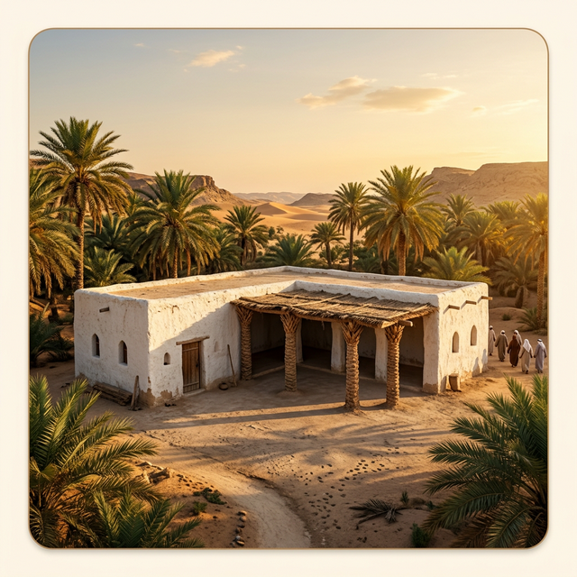

# Atlal (أطلال) - AR Historical Exploration

  

### 🏛️ About The Project
**Atlal (أطلال)** is a location-based Augmented Reality (AR) application that acts as a "Time Portal". 
It allows users to visit real-world historical landmarks and use their camera to see a 3D reconstruction of the site exactly as it looked hundreds of years ago.

**Features:**
- **🌍 Multi-Era AR Simulation**: View interactive reconstructions of landmarks like Quba Mosque and Ain Zubaida.
- **🎙️ Neural Voice Narrator**: High-quality, perfectly-synced AI narrators telling the stories of these landmarks in fluent Arabic and English.
- **🎮 Interactive 3D Movement**: Use an on-screen D-Pad or touch/drag controls to physically explore the historical space inside the AR layer.
- **📜 Gamified Explorer Passport**: Collect unique stamps in your digital passport when visiting physical locations.
- **🌐 Bilingual UI**: Seamlessly switch between Arabic (RTL) and English (LTR).

---

### 🤝 Project Co-Founders
This project is officially a **joint collaboration** resulting from shared efforts.

**Contributors:**
- **fahilaly:**
- **alftaa:**

*All visual assets, algorithms, logic, and audio recordings were developed jointly within the Atlal team.*
